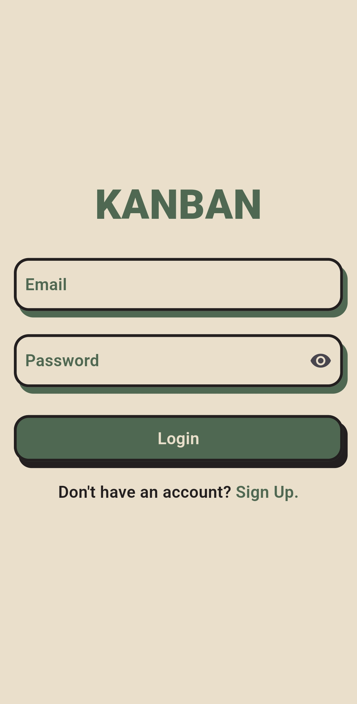
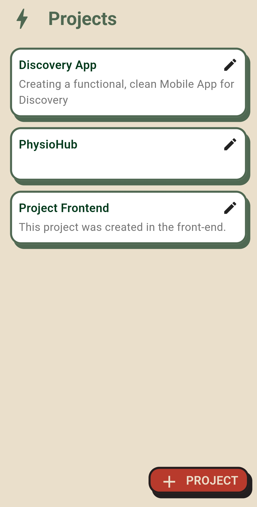
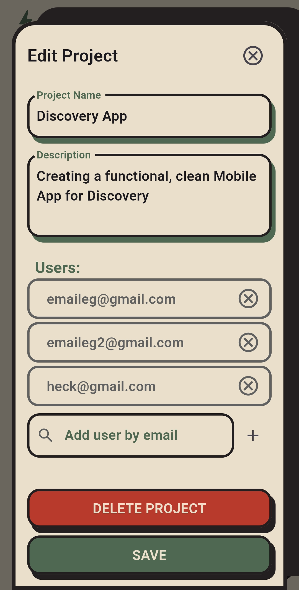
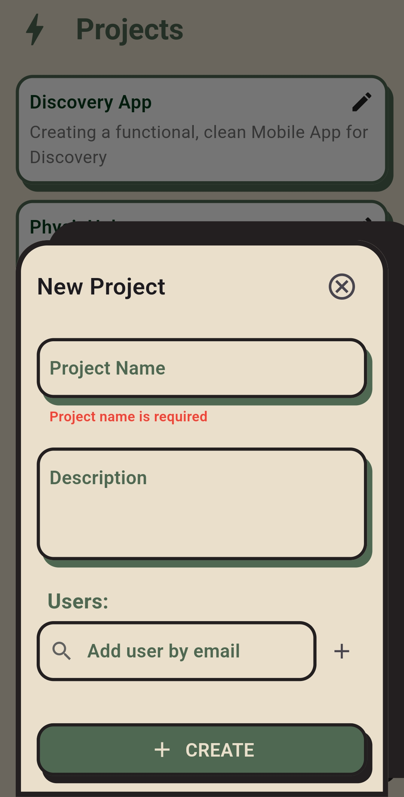
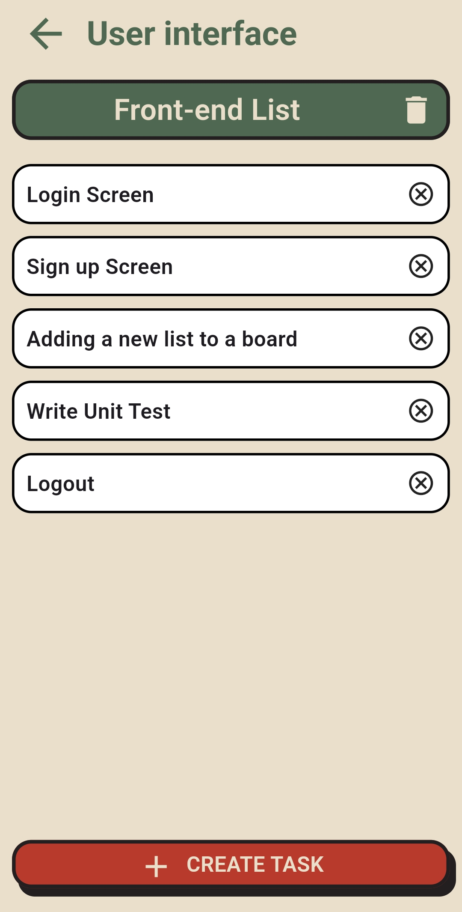
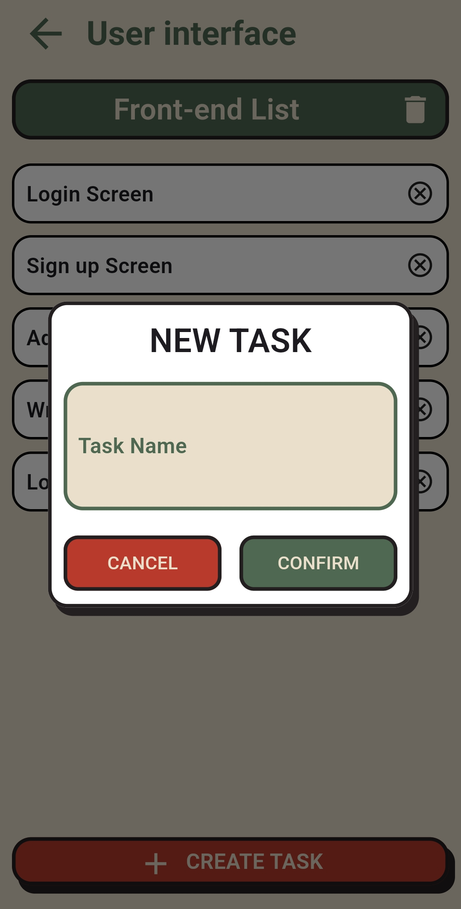

# Epic Task Manager

A full-stack Kanban-style task management application built with:
- **Flutter** (frontend)
- **.NET 6 Web API** (backend)
- **MySQL** (database)

---

## 📁 Project Structure
```bash
epic-task-manager/
├── backend/KanbanApi → .NET API project
├── kanban_app/ → Flutter mobile frontend (tested on Android)
├── db/ → SQL dump and DB model (.mwb)
```

## ⚙️ Requirements

- Flutter (Stable channel – match version in `kanban_app/pubspec.yaml`)
- .NET 6 SDK
- MySQL Server (8.x preferred)
- Android Emulator or physical device
- Git

---

## 🚀 Setup Instructions

### 1️⃣ Clone the Repository

```bash
git clone https://github.com/your-username/epic-task-manager.git
cd epic-task-manager
```

### 2️⃣ Set Up the Database
Import the schema and data
```bash
mysql -u root -p < db/kanban_db.sql
```
This creates the kanban_db with relevant tables and data.

### 3️⃣ Configure the Backend (.NET API)
Navigate to the backend/KanbanApi folder:
```bash
cd backend/KanbanApi
```

**Option 1: Set up User Secrets (recommended)**
```bash
dotnet user-secrets init
dotnet user-secrets set "ConnectionStrings:DefaultConnection" "server=localhost;port=3306;database=kanban_db;user=root;password=yourpassword"
```
> ⚠️ **Important:** Replace `yourpassword` with your actual MySQL password.  
> If you're using a different MySQL user (not `root`), update the `user=` value too.

**Option 2: Edit appsettings.json (for local testing only)**
```json
{
  "ConnectionStrings": {
    "DefaultConnection": "server=localhost;port=3306;database=kanban_db;user=root;password=yourpassword"
  },
  "Logging": {
    "LogLevel": {
      "Default": "Information",
      "Microsoft.AspNetCore": "Warning"
    }
  },
  "AllowedHosts": "*"
} 
```
**Run the API**
```bash
dotnet restore
dotnet run
```
The API will start on http://localhost:5000 (or whatever port is configured).

### 4️⃣ Configure and Run the Flutter App
Navigate to the frontend directory
```bash
cd ../kanban_app
flutter pub get
```

**Update API Base URL**
In the following files:
- lib/api/list_api.dart
- lib/api/project_api.dart
- lib/api/board_api.dart
- lib/api/api_auth.dart

**Replace**
```dart
const String baseUrl = "http://192.168.x.x:5000/api";
```
**With**
```dart
// For Android Emulator
const String baseUrl = "http://10.0.2.2:5000/api";

// Or your actual host IP if using a physical device
```

###Run the App on Android
```bash
flutter run
```

### Admin Login (for testing)
| Role  | Email            | Password    |
| ----- | ---------------- | ----------- |
| Admin | `emaileg@gmail.com` | `MySecret123!` |


### 🧪 API Endpoints Overview
```bash
Example routes: 
POST /api/auth/login – login
GET /api/project – get projects (note: requires admin role)
POST /api/list – create task lists
PUT /api/card/{id} – update task card
```
Explore via Postman

### 📝 Notes
- Android-only support has been tested.
- The app does not currently use a .env; all configurations are hardcoded in the Dart API classes.
- Use UserSecrets for secure backend config, or provide an appsettings.Development.json locally.
- Ensure MySQL is running and listening on port 3306.

###Screenshots
### 📸 Application Screenshots

| Login | Project Dashboard | Edit Project |
|-------|-------------------|--------------|
|  |  |  |

| Create Project | List of Tasks | Create Task |
|----------------|---------------|-------------|
|  |  |  |
